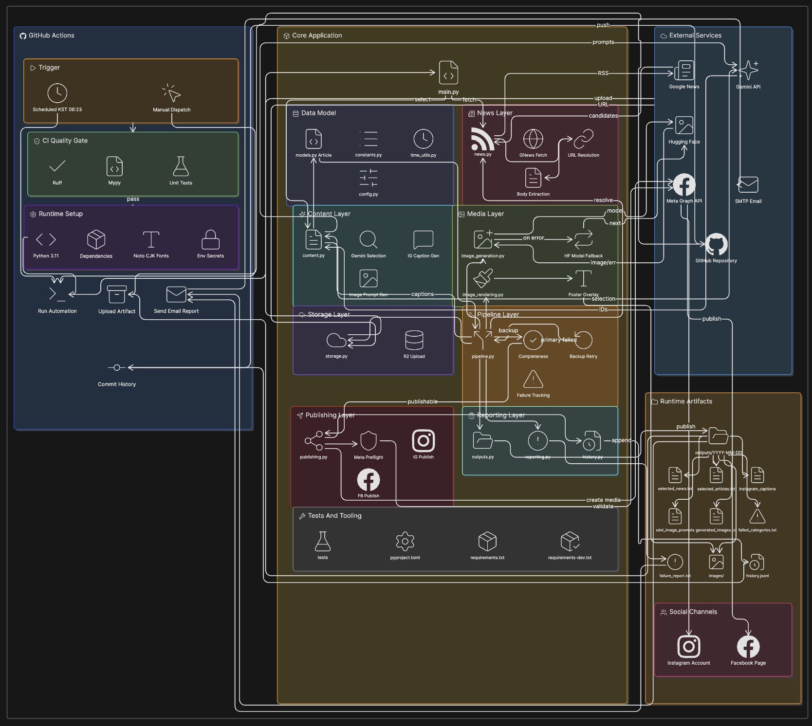

# Meta Automation

Meta Automation collects candidate articles from Google News, selects three articles with Gemini, generates Korean captions and poster images, uploads the images to Cloudflare R2, and publishes the final posts to Instagram and a Facebook Page.

The production runtime is GitHub Actions. The workflow runs automatically every day at 06:23 KST, and it can also be started manually from the Actions tab.



## Production Setup

| Item | Value |
| --- | --- |
| Workflow | `.github/workflows/daily-upload.yml` |
| Runtime | GitHub-hosted Ubuntu runner |
| Schedule | `23 21 * * *` UTC, 06:23 KST |
| Manual run | `workflow_dispatch` |
| Python | 3.11 |
| Publish mode | `DRY_RUN=false` |
| Daily post limit | `MAX_DAILY_POSTS=3` |
| Publish window | `UPLOAD_WINDOW_MINUTES=15` |
| Post spacing | `POST_SPACING_MINUTES=5` |
| Reporting | SMTP email + GitHub artifact |

## Execution Flow

1. GitHub Actions checks out the repository.
2. The runner installs Python, Noto CJK fonts, and production dependencies.
3. The CI quality gate installs development dependencies and runs `ruff`, `mypy`, and `unittest`.
4. GitHub Secrets are written into a runtime `.env` file.
5. `main.py` starts the full automation pipeline.
6. `news.py` collects Google News candidates, filters excluded sources, and removes previously published articles.
7. Gemini selects one primary article and one backup article for each category.
8. Selected articles are normalized into the `Article` dataclass.
9. The pipeline resolves source URLs, extracts article bodies, generates captions, generates image prompts, creates images, renders poster overlays, and uploads final images to R2.
10. If a primary article does not pass the completion check, the backup article for the same category is processed.
11. Before publishing, Meta preflight checks verify Instagram and Facebook Page access.
12. The automation publishes to Instagram and Facebook Page, then writes successful publish history to `history.jsonl`.
13. Runtime outputs and failure summaries are sent by email and uploaded as GitHub Actions artifacts.
14. On successful workflow completion, GitHub Actions commits the updated `history.jsonl` file back to `main`.

## Main Modules

| File | Responsibility |
| --- | --- |
| `main.py` | Batch entry point |
| `models.py` | `Article` dataclass and dict compatibility helpers |
| `constants.py` | Centralized status strings |
| `time_utils.py` | KST-based date and time helpers |
| `config.py` | Environment-based runtime settings |
| `news.py` | Google News collection, URL resolution, and body extraction |
| `content.py` | Gemini article selection, caption generation, and image prompt generation |
| `image_generation.py` | Hugging Face image generation with model fallback |
| `image_rendering.py` | News poster overlay rendering |
| `storage.py` | Cloudflare R2 upload |
| `pipeline.py` | Content pipeline orchestration, completion checks, and backup retry |
| `publishing.py` | Meta preflight, Instagram publishing, and Facebook Page publishing |
| `outputs.py` | Runtime output files |
| `reporting.py` | Failure summary generation |
| `history.py` | Publish history and duplicate prevention |
| `tests/` | Unit tests for core model, pipeline, and rendering behavior |

## Data Model

Article data is represented by `models.Article`.

Important fields:

```text
id
category
title
source
google_link
backup_article
resolved_link
body
instagram_caption
sdxl_image_prompt
image_path
final_image_path
public_image_url
publish_status
```

`Article.from_dict()` and `Article.to_dict()` keep compatibility with existing outputs and external inputs. Unknown fields are preserved in `extra_fields` so schema changes do not silently drop data.

## Image Generation Strategy

Image generation uses the Hugging Face Inference API. To prevent a single provider timeout or model outage from failing the whole run, models are tried in priority order.

Current model priority:

```text
1. stabilityai/stable-diffusion-3.5-large-turbo
2. stabilityai/stable-diffusion-xl-base-1.0
3. black-forest-labs/FLUX.1-schnell
```

If all models fail, the article receives the `generation_failed` status and the pipeline moves to the category backup article.

## Publish Eligibility

An article must satisfy all of these conditions before it can be published:

- Body extraction succeeded
- Gemini caption generation succeeded
- Image prompt generation succeeded
- Hugging Face image generation succeeded
- Poster rendering succeeded
- R2 upload succeeded
- `final_image_path` exists
- `public_image_url` exists

If the primary article fails, the backup article is processed. If both primary and backup articles fail, the category is written to `failed_categories.txt`.

## Meta Publishing

`publishing.py` runs a preflight check before sending publish requests.

Preflight verifies:

- `META_ACCESS_TOKEN` can access `IG_USER_ID`
- `FACEBOOK_PAGE_ACCESS_TOKEN` can access `FACEBOOK_PAGE_ID`

If preflight fails, the automation does not create Instagram media containers or Facebook photo publish requests.

For long-term operation, use a Meta Business System User token with the required Page and Instagram assets assigned. The current GitHub Secrets split the Instagram and Facebook credentials intentionally so each channel can be rotated or debugged independently.

## Runtime Outputs

Every run writes outputs under a KST date folder.

```text
outputs/YYYY-MM-DD/
```

Representative files:

```text
gemini_selected_result.txt
selected_news.txt
selected_articles.txt
instagram_captions.txt
sdxl_image_prompts.txt
generated_images.txt
failed_categories.txt
failure_report.txt
images/
```

`failure_report.txt` is also included in the email body. `outputs/**/*.txt` files are attached to the report email and uploaded as GitHub Actions artifacts.

Successful publish history is appended to:

```text
history.jsonl
```

This file is used for duplicate prevention and daily post limit calculation, so the workflow commits it back to `main` after a successful run.

## Required GitHub Secrets

Add these values in `Settings > Secrets and variables > Actions`.

### Gemini / Hugging Face

```text
GEMINI_API_KEY
HF_TOKEN
```

### Cloudflare R2

```text
R2_ACCOUNT_ID
R2_ACCESS_KEY_ID
R2_SECRET_ACCESS_KEY
R2_BUCKET_NAME
R2_PUBLIC_BASE_URL
```

### Meta / Instagram / Facebook

```text
META_ACCESS_TOKEN
IG_USER_ID
FACEBOOK_PAGE_ID
FACEBOOK_PAGE_ACCESS_TOKEN
```

Recommended values:

```text
META_ACCESS_TOKEN = Meta Business System User token
IG_USER_ID = Instagram Business Account ID
FACEBOOK_PAGE_ID = Facebook Page ID
FACEBOOK_PAGE_ACCESS_TOKEN = Facebook Page access token from /me/accounts
```

The System User must have access to the Facebook Page, Instagram Business Account, and Meta app used by the automation. Required permissions typically include `pages_show_list`, `pages_read_engagement`, `pages_manage_posts`, `pages_manage_metadata`, `instagram_basic`, and `instagram_content_publish`.

### Email Report

```text
SMTP_HOST
SMTP_PORT
SMTP_USERNAME
SMTP_PASSWORD
REPORT_EMAIL_TO
```

Gmail SMTP example:

```text
SMTP_HOST=smtp.gmail.com
SMTP_PORT=587
SMTP_USERNAME=<sender-gmail-address>
SMTP_PASSWORD=<gmail-app-password>
REPORT_EMAIL_TO=<recipient-email-address>
```

## Local Development

Create a virtual environment and install production dependencies.

```bash
python3 -m venv venv
source venv/bin/activate
pip install -r requirements.txt
```

Install development dependencies for linting, type checking, and tests.

```bash
pip install -r requirements-dev.txt
```

Create a local `.env` file for local execution.

```env
GEMINI_API_KEY=
HF_TOKEN=

R2_ACCOUNT_ID=
R2_ACCESS_KEY_ID=
R2_SECRET_ACCESS_KEY=
R2_BUCKET_NAME=
R2_PUBLIC_BASE_URL=

META_ACCESS_TOKEN=
IG_USER_ID=
FACEBOOK_PAGE_ID=
FACEBOOK_PAGE_ACCESS_TOKEN=

MAX_DAILY_POSTS=3
UPLOAD_WINDOW_MINUTES=15
POST_SPACING_MINUTES=5
```

Production values are managed through GitHub Actions Secrets. If local `.env` values differ from Actions secrets, local publish verification is not authoritative.

## Quality Checks

Syntax check:

```bash
python3 -m py_compile main.py models.py constants.py reporting.py pipeline.py image_generation.py content.py news.py image_rendering.py storage.py outputs.py publishing.py history.py config.py time_utils.py
```

Static checks:

```bash
python3 -m ruff check .
python3 -m mypy .
```

Unit tests:

```bash
python3 -m unittest discover -s tests
```

Full local check:

```bash
python3 -m ruff check .
python3 -m mypy .
python3 -m unittest discover -s tests
```

## Operations Notes

- The workflow runs on GitHub-hosted runners, so the local laptop does not need to be online.
- The scheduled runtime is 06:23 KST.
- Output folders, poster dates, and daily post limits use KST.
- With `DRY_RUN=false`, manual workflow dispatches publish real Instagram and Facebook posts.
- Publish timing is controlled by `UPLOAD_WINDOW_MINUTES` and `POST_SPACING_MINUTES`.
- Some publishers may return `401`, `402`, or `403` during article body download.
- If `trafilatura` cannot extract enough body text, the article fails and the pipeline moves to the backup article.
- If Meta returns `OAuthException`, `code 190`, or `Session has expired`, check the System User token, Page/Instagram asset assignment, and GitHub Secrets first.

## Common Commands

Check repository status:

```bash
git status --short --branch
```

Pull latest remote changes:

```bash
git pull --rebase origin main
```

Commit and push changes:

```bash
git add <files>
git commit -m "<message>"
git push origin main
```

If a GitHub Actions history commit causes a push conflict, pull the remote history first.

```bash
git pull --rebase origin main
git push origin main
```

## Security

Never commit this file:

```text
.env
```

This project uses official APIs:

- Google Gemini API
- Hugging Face Inference API
- Cloudflare R2 S3-compatible API
- Meta Graph API
- SMTP

Operators are responsible for complying with publisher policies, provider terms, Meta Platform policies, and copyright requirements.
